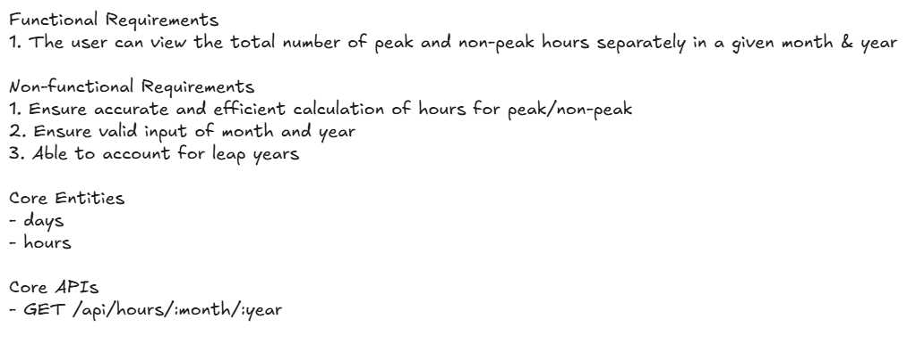

# Estimate Power Plant Hours
Software application to estimate the peak and non-peak hours for a given month and year

## Overview


## Requirements
Python > v3.12
Poetry > v2.0.1

## Setup
1. Install dependencies for the project
```
poetry install
```


## Usage
Start the application
```
poetry run uvicorn hours_calculator.main:app --reload
```

To run unit test
```
poetry run pytest
```

## Documentation
API documentations are avaliable at http://localhost:8000/docs

Change the port number accordingly if not using the default port